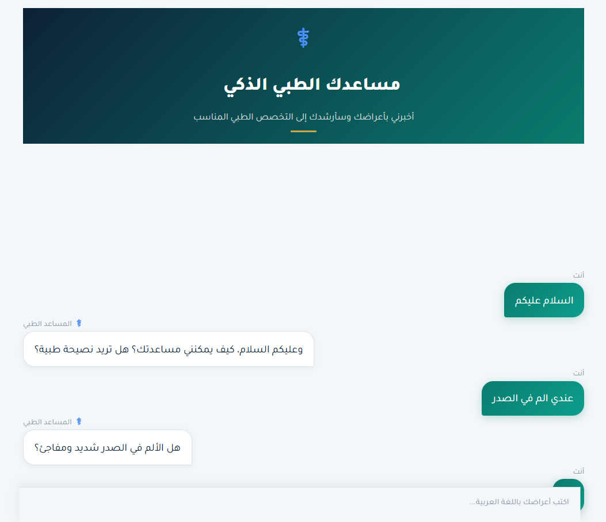
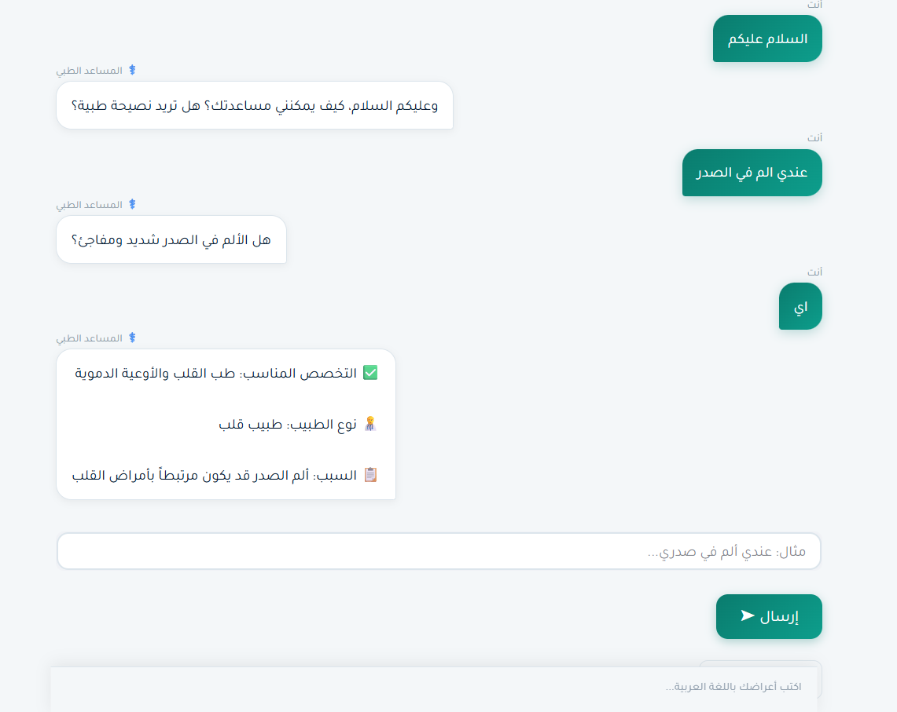

<div align="center">

# 🏥 مساعدك الطبي الذكي
### AI Medical Chatbot


<br>
<br>

> An intelligent Arabic medical chatbot that guides patients to the right medical specialist through a smart conversational experience.

[Features](#-features) • [Installation](#-installation) • [Usage](#-usage) • [Deployment](#-deployment)

</div>

---

## ✨ Features

- 🗣️ **Full Arabic Support** — Designed for Arabic-speaking patients with RTL interface
- 🧠 **Smart Conversation** — Asks follow-up questions to accurately determine the right specialist
- ⚡ **Lightning Fast** — Powered by Groq's ultra-fast LLM inference
- 🚨 **Emergency Detection** — Instantly detects critical symptoms and directs to emergency care
- 🎨 **Beautiful UI** — Modern chat interface with smooth typing animations
- 📱 **Responsive Design** — Works on desktop and mobile browsers
- 🔒 **Secure** — API keys stored safely via Streamlit Secrets

---

## 🩺 Supported Specialties

| Specialty | Arabic |
|-----------|--------|
| Cardiology | طب القلب والأوعية الدموية |
| Orthopedics | طب العظام والمفاصل |
| Gastroenterology | طب الجهاز الهضمي |
| Dermatology | طب الجلدية |
| Ophthalmology | طب العيون |
| ENT | طب الأذن والأنف والحنجرة |
| Urology | طب المسالك البولية |
| Neurology | طب الأعصاب |
| Endocrinology | طب الغدد الصماء والسكري |
| Psychiatry | الطب النفسي |
| Pediatrics | طب الأطفال |
| Gynecology | طب النساء والتوليد |
| Pulmonology | طب الأمراض الصدرية |
| General Medicine | الطب العام |

---

## 🚀 Installation

### Prerequisites
- Python 3.8+
- A free [Groq API Key](https://console.groq.com)

### Steps

**1. Clone the repository**
```bash
git clone https://github.com/nooraaljaafar7-star/medical-chatbot.git
cd medical-chatbot
```

**2. Create a virtual environment**
```bash
python -m venv venv

# Windows
venv\Scripts\activate

# macOS/Linux
source venv/bin/activate
```

**3. Install dependencies**
```bash
pip install -r requirements.txt
```

**4. Add your API Key**

Open `app.py` and replace the empty string with your Groq API key:
```python
GROQ_API_KEY = "your_groq_api_key_here"
```

**5. Run the app**
```bash
streamlit run app.py
```

The app will open automatically at `http://localhost:8501` 🎉

---

## 💬 Usage

1. Open the app in your browser
2. Describe your symptoms in Arabic
3. Answer the follow-up questions
4. Receive a recommendation for the appropriate medical specialist

---

## ☁️ Deployment

### Deploy on Streamlit Cloud (Free)

1. Fork this repository
2. Go to [share.streamlit.io](https://share.streamlit.io)
3. Click **New app** → select your repo → set main file to `app.py`
4. Go to **Advanced Settings** → **Secrets** and add:
```toml
GROQ_API_KEY = "your_groq_api_key_here"
```
5. Click **Deploy** ✅

---

## 🛠️ Tech Stack

| Technology | Purpose |
|------------|---------|
| [Streamlit](https://streamlit.io) | Web framework |
| [Groq API](https://groq.com) | LLM inference (llama-3.3-70b) |
| Python | Backend logic |
| HTML/CSS | Custom UI styling |

---

## 📁 Project Structure

```
medical-chatbot/
│
├── app.py              # Main application
├── requirements.txt    # Python dependencies
└── README.md           # Project documentation
```

---

## ⚠️ Disclaimer

> This chatbot is designed to **guide patients** to the appropriate medical specialty only. It does **not** provide medical diagnoses or replace professional medical advice. Always consult a qualified healthcare professional for medical decisions.

---


<div align="center">

Made with ❤️ for Arabic-speaking patients

</div>
